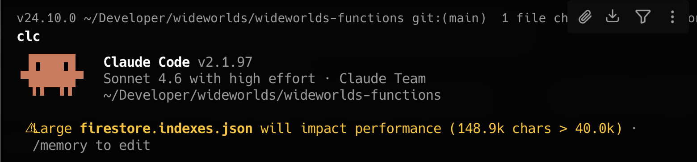

# firestore-index-analyzer

Find and remove unused Firestore composite indexes by statically scanning your TypeScript codebase.

## Origin story



This warning — every single time — is what finally motivated building this tool.

## Why

Firestore charges for index storage and — more importantly — maintains every composite index on every write. As projects grow, `firestore.indexes.json` accumulates indexes from deprecated features, renamed collections, and refactored queries. This tool identifies which ones are actually needed.

## Install

```bash
npm install -g firestore-index-analyzer
```

Or run without installing:

```bash
npx firestore-index-analyzer
```

## Usage

Run from your project root (where `firestore.indexes.json` lives or one level up):

```bash
# Report only — never modifies files
firestore-index-analyzer

# Show which queries matched each used index
firestore-index-analyzer --verbose

# Remove unused indexes from firestore.indexes.json
firestore-index-analyzer --dangerously-purge
```

### Options

| Flag | Description | Default |
|------|-------------|---------|
| `--root <path>` | Root directory to scan | Current working directory |
| `--scan <dirs>` | Comma-separated directories to scan (resolved from CWD) | Entire `--root` |
| `--indexes <path>` | Path to `firestore.indexes.json` | Auto-discovered |
| `--output <path>` | Where to write `report.md` | `./report.md` |
| `--dangerously-purge` | Remove unused indexes from `firestore.indexes.json` in place | false |
| `--verbose` | Show matched queries for each used index | false |

### Monorepo example

```bash
firestore-index-analyzer \
  --root . \
  --scan functions/src,dashboard/src,web-app/src \
  --indexes functions/firestore.indexes.json
```

## How it works

1. **Scan** — recursively finds all `.ts` and `.tsx` files in the target directories (skips `node_modules`, `dist`, `.next`, etc.)
2. **Parse** — uses the TypeScript AST (via `ts-morph`) to extract Firestore queries without running code
3. **Match** — for each composite index, checks whether any extracted query actually requires it
4. **Report** — prints a summary to the terminal and writes a `report.md`
5. **Purge** *(optional)* — rewrites `firestore.indexes.json` with unused indexes removed

### Supported query patterns

**Admin SDK (chained):**
```typescript
firestore.collection('orders')
  .where('userId', '==', userId)
  .orderBy('createdAt', 'desc')
  .get()
```

**Client SDK (functional):**
```typescript
query(
  collection(db, 'orders'),
  where('userId', '==', userId),
  orderBy('createdAt', 'desc'),
)
```

**Dynamic Admin SDK (conditional filters):**
```typescript
let ref = db.collection('products');
if (filters.status) ref = ref.where('status', '==', filters.status);
if (sortBy === 'price') ref = ref.orderBy('price', 'desc');
ref.get()
```

**Dynamic Client SDK (ternary spreads + reassignment):**
```typescript
let q = query(collection(db, 'posts'), where('authorId', '==', id));
if (tag) q = query(q, where('tags', 'array-contains', tag));
// or
query(col, ...(published ? [where('status', '==', 'published')] : []))
```

### Conservative by design

Only string literal collection names and field names are analyzed. If a query uses a variable or template literal for the collection name or field name, it is **skipped** — those indexes are never marked unused. This prevents false positives at the cost of some false negatives.

For dynamic queries (conditional where/orderBy), the tool enumerates all possible combinations of active constraints and checks whether any of them would require the index. An index is only marked unused if *no* possible instantiation of any query needs it.

`fieldOverrides` in `firestore.indexes.json` are never touched.

## Output

```
firestore-index-analyzer
  indexes : firestore.indexes.json
  scanning: functions/src

Loaded 847 TypeScript files
Extracting Firestore queries ...
Found 203 queries
Loading indexes ...
Matching ...

──────────────────────────────────────────────────
Scanned 847 files  ·  312 indexes  ·  203 queries extracted

  ● USED    269   covered by at least 1 query
  ● UNUSED   43   no matching query found

UNUSED INDEXES (43)

  orders
    [deletedAt ASC, status ASC, userId ASC, createdAt DESC]
  events
    [categoryId ASC, flagged ASC]
  ...

Run with --dangerously-purge to remove 43 indexes from firestore.indexes.json
Report written to report.md
```

## Limitations

- Only TypeScript files are analyzed (`.ts`, `.tsx`)
- Dynamic collection/field names (variables, template literals) are conservatively skipped
- Queries constructed via abstraction layers or helper wrappers may not be detected
- Does not analyze security rules or `fieldOverrides`

## License

MIT
